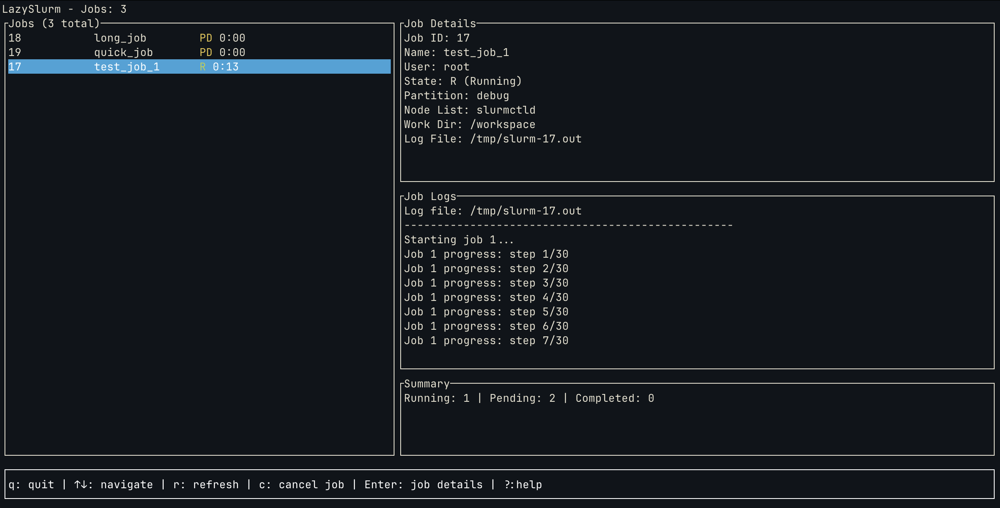

# LazySlurm

[](https://github.com/hill/lazyslurm/actions)
[](https://crates.io/crates/lazyslurm)
[](https://opensource.org/licenses/MIT)

A terminal UI for [slurm](https://slurm.schedmd.com/overview.html) job management. Like the awesome [lazygit](https://github.com/jesseduffield/lazygit) but for HPC clusters.



## Why This Exists

Slurm's CLI is powerful but clunky for monitoring. This project gives you the lazygit experience.
Built in Rust with ratatui because single binaries are beautiful on HPC systems.

## Features

- **Job management** - Cancel jobs, view details, and monitor resource usage
- **Single binary** - No dependencies, perfect for HPC environments
- **Real-time job monitoring** - Watch your jobs as they run, with live log tailing

## Installation

### Binary Releases

Download the latest binary for your platform from [GitHub Releases](https://github.com/hill/lazyslurm/releases):

```bash
# Linux x64
curl -L https://github.com/hill/lazyslurm/releases/latest/download/lazyslurm-linux-x64.tar.gz | tar xz
sudo mv lazyslurm /usr/local/bin/

# macOS (Apple Silicon)
curl -L https://github.com/hill/lazyslurm/releases/latest/download/lazyslurm-macos-arm64.tar.gz | tar xz
sudo mv lazyslurm /usr/local/bin/

# macOS (Intel)
curl -L https://github.com/hill/lazyslurm/releases/latest/download/lazyslurm-macos-x64.tar.gz | tar xz
sudo mv lazyslurm /usr/local/bin/
```

### Homebrew

```bash
brew install hill/tap/lazyslurm
```

### Cargo

If you have [Rust installed](https://rustup.rs/):

```bash
cargo install lazyslurm
```

### Gah

```sh
gah install hill/lazyslurm
```

## Usage

### Basic Usage

```bash
# Monitor all jobs for current user
lazyslurm

# Monitor jobs for specific user
lazyslurm --user username

# Monitor jobs in specific partition
lazyslurm --partition gpu
```

### Keyboard Controls

| Key | Action |
|-----|--------|
| `q` | Quit application |
| `↑/↓` or `j/k` | Navigate job list |
| `r` | Refresh job data |
| `c` | Cancel selected job |
| `Enter` | View job details |
| `l` | View job logs |
| `?` | Show help |

### Configuration

LazySlurm reads configuration from `~/.config/lazyslurm/config.toml`:

```toml
[display]
refresh_interval = 5  # seconds
max_log_lines = 100

[slurm]
default_user = "myusername"
default_partition = "compute"
```

## Development

Requires Docker and [just](https://github.com/casey/just).

```bash
# Start SLURM container
just slurm_up

# Get into container for development
just slurm_shell

# Inside container: your code is at /workspace
cargo run

# Submit test jobs (from host or container)
just slurm_populate
```

Your source code is mounted into the container so changes are immediately available.