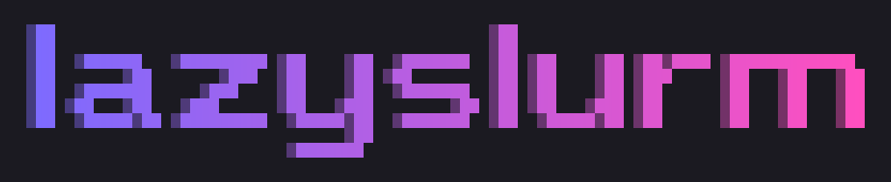

<p align="center">
  
</p>

<p align="center">
  A terminal UI for <a href="https://slurm.schedmd.com/overview.html">Slurm</a>. Like <a href="https://github.com/jesseduffield/lazygit">lazygit</a>, but for HPC clusters.
</p>

<p align="center">
  <a href="https://github.com/hill/lazyslurm/actions"></a>
  <a href="https://crates.io/crates/lazyslurm"></a>
  <a href="https://opensource.org/licenses/MIT"></a>
</p>

<p align="center">
  <a href="media/demo.mp4"></a>
</p>

## Why This Exists

Slurm's CLI is powerful but clunky for monitoring.
This gives you the lazygit experience for your cluster.
Built in Rust with [ratatui](https://ratatui.rs/) and released as a single binary.

## Features

- Monitor your jobs with live log tailing, job details and ability to cancel jobs
- See per-node state, CPU load, free memory and GPU (gres) allocation across the cluster
- Partition availability, idle/allocated nodes and time limits.
- See finished jobs from `sacct` with details

## Installation

### Binary Releases

Download the latest binary for your platform from [GitHub Releases](https://github.com/hill/lazyslurm/releases):

```bash
# Linux x64 (glibc)
curl -L https://github.com/hill/lazyslurm/releases/latest/download/lazyslurm-x86_64-unknown-linux-gnu.tar.gz | tar xz
sudo mv lazyslurm /usr/local/bin/

# Linux x64 (static musl build, best for older cluster login nodes)
curl -L https://github.com/hill/lazyslurm/releases/latest/download/lazyslurm-x86_64-unknown-linux-musl.tar.gz | tar xz
sudo mv lazyslurm /usr/local/bin/

# macOS (Apple Silicon)
curl -L https://github.com/hill/lazyslurm/releases/latest/download/lazyslurm-aarch64-apple-darwin.tar.gz | tar xz
sudo mv lazyslurm /usr/local/bin/

# macOS (Intel)
curl -L https://github.com/hill/lazyslurm/releases/latest/download/lazyslurm-x86_64-apple-darwin.tar.gz | tar xz
sudo mv lazyslurm /usr/local/bin/
```

Windows builds (`lazyslurm-x86_64-pc-windows-msvc.zip`) are on the [releases page](https://github.com/hill/lazyslurm/releases/latest).

### Homebrew

```bash
brew install hill/tap/lazyslurm
```

### Cargo

If you have [Rust installed](https://rustup.rs/):

```bash
cargo install lazyslurm
```

### Gah

```sh
gah install hill/lazyslurm
```

## Usage

```bash
# Monitor all jobs for the current user
lazyslurm

# Filter to a specific user
lazyslurm --user username

# Filter to a specific partition
lazyslurm --partition gpu

# Start in a different theme
lazyslurm --theme gruvbox-dark
```

The `Jobs` tab works without any extra setup. The `Nodes` and `Partitions` tabs use `sinfo`, and `History` uses `sacct` (which needs Slurm accounting enabled on the cluster).

### Keyboard Controls

**Global**

| Key | Action |
|-----|--------|
| `q` / `Ctrl+C` | Quit |
| `Tab` / `Shift+Tab` | Switch tabs |
| `1`–`5` | Jump to a tab |
| `↑/↓` or `j/k` | Navigate the current list |
| `r` | Refresh |
| `u` | Filter by user |
| `T` | Pick a theme |

**Jobs tab**

| Key | Action |
|-----|--------|
| `←/→` or `h/l` | Move focus between panels |
| `Enter` | Fullscreen the focused pane |
| `/` | Filter the list by name or id |
| `P` | Pin / unpin the selected job |
| `c` | Cancel the selected job |
| `y` | Raw log view (with the Logs pane focused) |

**History tab**

| Key | Action |
|-----|--------|
| `Enter` | Open the job detail view |
| `y` | Raw log view (in the detail view) |

**Log views**

| Key | Action |
|-----|--------|
| `G` / `g` | Follow the tail |
| `y` | Open the raw view, then drag-select to copy |
| `Esc` | Back |

## Theming

Press `T` to open the theme picker. Moving the selection applies the theme straight away so you can see it, `Enter` keeps it, `Esc` puts the old one back.

Nine themes ship in the box:

`lazyslurm` (the default), `gruvbox-dark`, `gruvbox-light`, `catppuccin-mocha`, `catppuccin-latte`, `nord`, `dracula`, `tokyonight`, `tokyonight-day`.

Confirming a choice in the picker writes it to `~/.config/lazyslurm/config.toml`, which you can also edit by hand:

```toml
theme = "gruvbox-dark"
```

A `--theme` flag beats the `LAZYSLURM_THEME` environment variable, which beats the config file. `lazyslurm --list-themes` prints what is available.

The default theme leaves the background alone so it sits over whatever your terminal is doing, transparency included. The light themes have to paint an opaque background, or their text would land on a dark terminal.

### Writing your own

Drop a TOML file into `~/.config/lazyslurm/themes/`. The filename is the theme name, so `~/.config/lazyslurm/themes/solarised.toml` shows up in the picker as `solarised`. Naming a file after a built-in retunes that built-in in place.

The quickest start is to dump one you already like and edit it:

```bash
lazyslurm --theme nord --print-theme > ~/.config/lazyslurm/themes/mine.toml
```

Or set `extends` and override only what you want to change:

```toml
extends = "nord"          # any built-in name; everything unset is inherited
accent     = "#268BD2"    # focused borders, key hints, brand badge
accent_alt = "#D33682"    # job-name pill, update badge, pinned star
bg         = "#002B36"    # omit to inherit, or "reset" to stay transparent
```

Every slot:

| Key | Used for |
|-----|----------|
| `accent` | Focused borders and titles, key hints, brand badge, cursors |
| `accent_alt` | Job-name pill, update badge, pinned star |
| `running` `pending` `completed` `failed` `cancelled` | Job state badges and bars |
| `fg` | Primary text |
| `muted` | Labels, placeholders, hint text |
| `border` | Unfocused borders and separators |
| `badge_fg` | Text drawn on a filled badge, so usually the theme's own background tone |
| `select_bg` | Selected row background |
| `column_bg` | Focused column background in the fullscreen table |
| `bg` | The canvas. Omit it to leave your terminal's background showing |

Colours can be hex (`#268BD2`), a name (`light-blue`, `red`), or a 256-colour index (`0`–`255`). Named and low-indexed colours defer to your terminal's own palette.

## Development

Requires Docker and [just](https://github.com/casey/just). The dev container runs a full Slurm install with accounting (slurmdbd + MariaDB), so every tab works locally.

```bash
# Build and start the Slurm container
just slurm_up

# Get a shell inside it
just slurm_shell

# Inside the container (your code is mounted at /workspace)
cargo run

# Submit some test jobs
just slurm_populate

# Inspect the cluster
just slurm_status    # squeue + sinfo
just slurm_prio      # sprio priority breakdown
just slurm_share     # sshare fairshare usage
just slurm_clear_jobs
```

Your source is mounted into the container, so changes are picked up immediately.

## License

MIT
